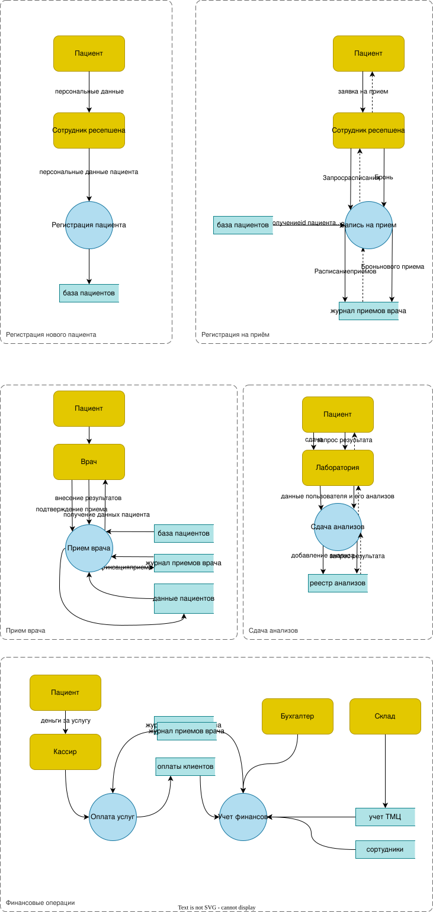
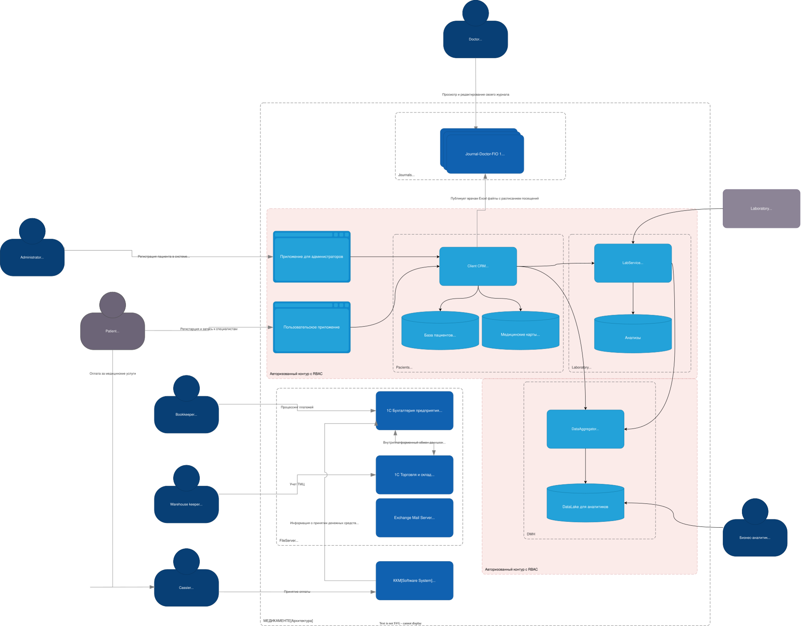
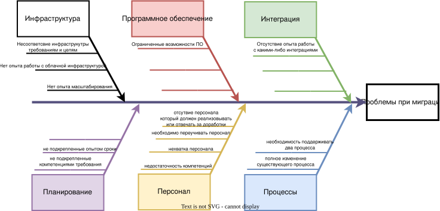

## Задание 1. Анализ безопасности системы

### Data flow диаграммы для основных процессов

**Внешние субъекты**:
- Пациент
- Кассир
- Сотрудник склада
- Бухгалтер
- Сотрудник ресепшена
- Специалист-медик
- Лаборатория

**Процессы в системе**:
- Регистрация пациента + Заполнение карточки, добавление данных пациента
- Запись пациента на приём к врачу
- Сохранение результатов приёма
- сдача анализов пациентом
- Оплата медициских услуг пациентом
- Процессинг платежей

**Диаграммы**:

### Аудит безопасности

Текущая файловая реализация хранения всех данных не поддерживает никаких принципов Privacy by Design
Любой пользователь имеющий доступ к внутренней файловой системе Медикаменте имеет доступ ко всей персональной и медицинской составляющей данных всех пользователей.
Кроме того нет никаких ограничений прав на чтение и доступ к файлам. Система полностью уязвима для порчи данных в том числе и неумышленной.

Основные проблемные точки:
- отсутствие администрируемых баз данных
- использование папок с excel файлами вместо реляционных баз данных
- открытое хранение разрозненных файлов с данными пользователей
- отсутствие защищенного контура и какой-либо системы разделения прав и ролей
- отсутсвие цифровой инфраструктуры для взаимодействия между системами

### Предложения по улучшению работы с данными

**Данные для защиты**:

- Персональные данные пользователей
- Медицинские данные пользователей
- Финансовые операции

Предлагаемые методы защиты для существующих потоков в процессах

- Регистрация пациента + Заполнение карточки, добавление данных пациента
  - шифрование данных. ограничение доступа к карте
- Запись пациента на приём к врачу
  - обезличивание
- Сохранение результатов приёма
  - обезличивание
  - обфускация заключений
- Сдача анализов пациентом
  - обезличивание
  - обфускация результатов
- Оплата медициских услуг пациентом
  - обезличивание
- Процессинг платежей
  - обезличивание
  - шифрование

[Диаграмма:](Task1/dataFlowDiagram2.drawio)

## Задание 2. Проектирование решения

К реализации предлагается:

- Создание авторизованного контура с RBAC.
- внутри контура взаимодействие между компонентами только с проверкой доступа к запрашиваемой информации
- приложения для администраторов и пользователей требуют прохождения 2FA
- для выгрузки в DataLake соответсвующие API выдают уже обезличенные и обфусцированнные данные

- в требованиях по развитию не было ни слова про приложение для врачей и вообще не сказано ничего насчет доработок в части взаимодействия врачей с системой.
Поэтому предложено сохранение работы врачей с Excel файлами расписаний. с которыми теперь будет работать CRM система.

Файловую "базу данных" по пациентам предлагается перенести в бд со структурированными данными (напрмер Postgres), а также добавить s3 подобное хранилище для неструктурированных данных (документы, сканы, снимки и тд).
Бд будет в себе хранить собственно базу пациентов а также метаданные данных из s3.

Предлагаемый к реализации Client CRM должен уметь работать с обоими хранилищами.

## Задание 3. Оценка Data Encryption at Rest and In Transit

Основные наборы данных требующих отдельного внимания

|Данные|В чем необходимость защиты|Инструменты защиты|
| ---- | ------------------------ | ---------------- |
|Медицинские карты, диагнозы, истории болезней, результаты анализов|регулируется 152-ФЗ. Утечка может привести к административной отвественности и штрафам||
|ФИО, паспортные данные, адреса, телефоны, email|регулируется регулируется 152-ФЗ. Утечка может привести к административной отвественности и штрафам||
|Реквизиты счетов, данные о платежах, финансовые отчеты|Может привести к мошенничеству и финансовым потерям||

Инструменты защиты зависят от состояния данных:

- at Rest 
  - Шифрование на уровне базы данных
  - шифрование с помощью закрытых ключей перед записью в БД

- In Transit
  - Transport Layer Security
  - VPN защищенный канал для внутренних сотрудников

- in Use
  - RBAC
  - Маскирование, обфускация

Для предотвращения угров возможно использование следующих технологий:

- Как было указано в планах развития, предполагается в перспективе развитие наблюдаемости системы.
Разумно начать использовать SIEM системы например Splunk для централизованного сбора и анализа логов со всех компонентов системы

- Централизованное управление ключами шифрования
Все ключи шифрования данных хранить не в приложении, а в отдельном, сильно защищенном хранилище.
Например Hashicorp Vault.

- Использование Data Loss Prevention (DLP)	
Предотвращение утечек данных через контролируемые каналы (email, USB, интернет).
Технологии - InfoWatch, Symantec DLP.
Например залокирует попытку отправить email с вложенным Excel-файлом, содержащим номера паспортов пациентов.

## Задание 4. Оценка узких мест при миграции

### Анализ ситуации

текущая команда:
IT-отдел — 3 специалиста: технический директор, администратор сети и бизнес-аналитик. 
- Технический директор выполняет функции архитектора. В его стек входят Java, Postgres, ClickHouse, Elastic, Kubernetes и Victoria Metrics.
- Администратор сети может всё ― от починки принтера до развёртывания кластера Kubernetes.
- Бизнес-аналитик умеет строить отчёты (P&L, ABC-анализ и другие) на основе Excel при помощи Jupiter и Python.

текущая система:
- Excel, Outlook и 1С. Их используют для работы на компьютерах в локальной сети компании.
- «1С:Бухгалтерия предприятия». Программа работает в файловом режиме. Её используют для учёта платежей, начисления зарплаты, кадрового учёта и подготовки документации для налоговых органов.
- «1С:Торговля и склад». Тоже работает в файловом режиме. В этой программе ведут учёт товарно-материальных ценностей (ТМЦ).
- Физический сервер с Microsoft Windows Server 2022. На нём настроены Active Directory, DNS, DHCP, LDAP, файловый сервер, Exchange Mail Server. ККМ связаны с сервером через TCP/IP и компоненту 1С по технологии OLE.

Цели: 
- Компания стремится обеспечить конфиденциальность, целостность и доступность данных — это приоритет «Медикаменте», который диктует подход к остальным трём целям компании
  - Интеграция лаборатории анализов с API
  - Расширение направления обработки данных (новые сервисы на базе BI-, ML- и AI-технологий)
  - Разработка новых систем и миграция
    - Чтобы автоматизировать процессы, компания планирует разработать:
      - портал для клиентов,
      - портал для сотрудников ресепшена,
      - платёжный шлюз,
      - CRM для сбора данных о клиентах,
      - интеграцию с лабораторией анализов.

- Промежуточное состояние (через пару месяцев). MVP, в котором клиент сможет самостоятельно записаться на приём к специалисту через портал компании. При этом команда ресепшена будет видеть эту запись: сотрудники смогут отследить запись в системе и за день до приёма напомнить про него и пациенту, и специалисту. Необходимо определить категории данных пациентов и разнести их по различным доменам. Для каждой категории данных определить роли (RBAC) или атрибуты (ABAC), на основании которых сотрудникам будет разрешён доступ к данным.

- Финальное состояние (через год). Полностью автоматический процесс записи к специалисту через портал и мобильное приложение. Пациенту приходят оповещения о записи через мобильное приложение или голосового робота. В ответ на оповещение клиент может подтвердить или отменить запись, при этом система отправляет оповещение на ресепшен. В мобильном приложении пациент может просматривать только свои данные (анализы, заключения, договор), у него нет доступа к данным других пациентов. В системе есть возможность помечать тегами данные, которые необходимо защитить. Релиз проверяется в автоматическом режиме на работу с тегированными данными, после чего информация передаётся в систему мониторинга и алертинга. В системе появилась возможность проводить аудит доступа к данным и отслеживать нетипичные действия пользователей. В случае несанкционированного доступа к данным команде приходят оповещения.

При разработке решения необходимо обеспечить следующие НФТ:

- Безопасность (конфиденциальность). Необходима гарантия того, что чувствительная информация будет безопасно храниться и обрабатываться. Чувствительные данные важно своевременно удалять. Если клиент обратится с соответствующим запросом, обработку его данных нужно прекратить.
- Масштабируемость. Система должна стабильно работать в условиях расширения бизнеса: компания открывает филиалы, нанимает десятки сотрудников и даёт клиентам возможность работать через мобильное приложение.
- Сопровождаемость. Нужно предусмотреть внесение изменений и улучшений в систему. Этот процесс должен быть простым и понятным.
- Конфигурируемость. В конфигурации можно вносить изменения без дополнительных доработок.

### Определить ключевые процессы и компоненты, затрагиваемые миграцией

Процессы:
- Регистрация пациента + Заполнение карточки, добавление данных пациента
- Запись пациента на приём к врачу

Компоненты:
- файловая система хранения пациентов
- файловая система хранения карт пациентов

Участники процессов:
- пользователь
- администратор
- врач

### Диаграмма Исикавы:

### Проблемы и предлагаемые решения:

|Проблема|Предлагаемое решение|
| ---- | -------------------- |
| Несоответсвие заявленных сроков и планов текущим компетенциям | Тщательная проработка планов развития. Декомпозиция задач ближайшего будущего. Найм сотрудников с необходимыми компетенциями |
| Увеличение нагрузки на существующий персонал | Найм дополнительных сотрудников. Разделение обязанностей по поддержанию старых процессов и запуску новых |
| Несоответсвие текущей инфраструктуры планам расширения | Проработка перехода на облачную инфраструктуру (приоритетно) либо вертикальное масштабирование собственных серверов |
| Изменение устоявшихся бизнес процессов | Документация обновленных бизнес процессов. Найм новых сотрудников с обучением новым процессам |